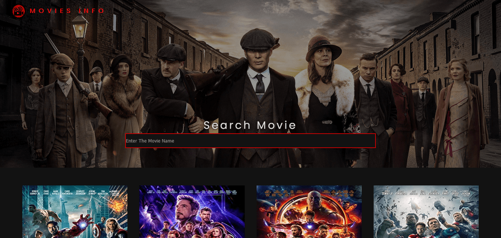

<a href="https://moviesinfoo.netlify.app/" ><h3>MOVIES INFO</h3> </a>

 
MOVIES INFO is an online database of information related to Films, Television programs, Series, including Lead cast, Plot summaries, Ratings, Director, Genre, Released year, Available languages.You can search any movie or series you want.

It was created using React and the data provided by an Api called <a href="https://www.omdbapi.com/"> OMDB Api </a>. They provide all Movies and Series Information for freemium. you can sign in and get their Api key.

This Web App was implemented using only npm and create-react-app. To navigate to other pages I used a npm package called react-router-dom.

You can use this repository for your projects if you want.
